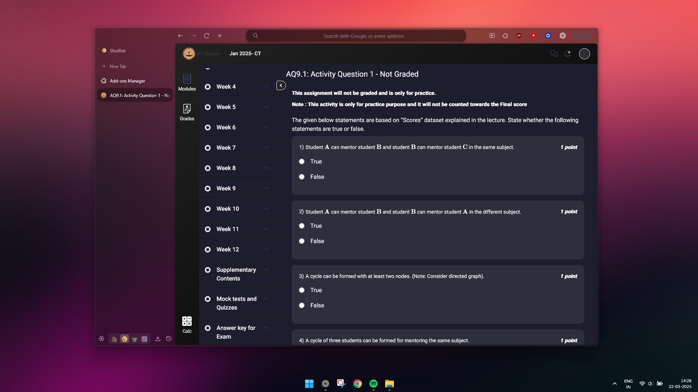

# Better Portal

A browser extension to apply custom themes to the IITM assignments portal, enhancing the visual experience while studying.



## Features

- 🎨 Multiple custom themes for the IITM online degree portal
- 🔄 Easy switching between themes with a single click
- 💾 Efficient theme storage that only downloads what you need
- 🔌 Works on both Chrome and Firefox
- 🌐 Compatible with all IITM portal pages (assignments, dashboard, documents)

## Installation

### Chrome/Edge
1. Download the latest release from the [Releases page](https://github.com/0xAadit/better-portal/releases)
2. Go to `chrome://extensions/` in your browser
3. Enable "Developer mode" in the top right
4. Drag and Drop the Extension!

### Firefox
1. Get on the [Add-ons](https://addons.mozilla.org/en-US/firefox/addon/better-portal/) store! (Realease pending)

## Usage

1. Click on the Better Portal extension icon in your toolbar
2. Choose from available themes in the popup
3. Click the download button next to a theme to download it
4. Toggle a theme on/off to apply it to the portal
5. Only one theme can be active at a time

## Available Themes

- **Dark Theme** - A sleek dark mode for reduced eye strain
- **Purple Night** - A purple-accented dark theme for a unique experience
- **Forest Mist** - A cool dew experience of the rainforests

More themes will be added in future updates!

## Development


### Building From Source
1. Clone the repository
```
git clone https://github.com/0xAadit/better-portal.git
```
2. Make your changes

## Chrome
1. Got to Chrome
2. Go to ``chrome://extensions/`` in the address bar.
3. In the top-right, enable Developer Mode.
4. Click "Pack extension".
5. Choose the root directory where `manifest.json` is located.
6. Click "Pack Extension", and Chrome will generate:  
   - A `.CRX` file (the actual extension package).  
   - A `.pem` file (private key, needed for future updates).
        Keep the `.pem` file safe! It’s required to update the extension in the future.
7. Drag and drop in ``chrome://extensions/`` and install.


## Firefox (Permanent Installation)
⚠️ Note: Firefox does not allow unsigned extensions to be installed permanently. You must sign the extension before using it normally.

1. Self-Signing

If you want to use the extension without AMO, Create an account on Firefox Developer Hub.
Use the Web-ext tool to sign it:
```
npm install -g web-ext
web-ext sign --api-key=YOUR-API-KEY --api-secret=YOUR-API-SECRET
```

## Contributing

Contributions are welcome! If you'd like to add a new theme or improve the extension:

1. Fork the repository
2. Create a new branch for your feature
3. Add your theme files in the `themes/[theme-name]/` directory
4. Make sure to include all required files: home, assignments, and extras CSS files and follow the naming convention.
5. Submit a pull request

## License

This project is licensed under the MIT License - see the [LICENSE](LICENSE) file for details.

## Acknowledgements

- Created by [0xAadit](https://github.com/0xAadit)
- Themes designed with IITM portal compatibility in mind